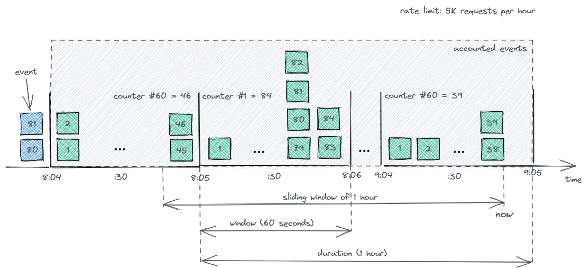

# rate-limiter-java

[](https://search.maven.org/search?q=g:%22io.github.akornatskyy%22%20AND%20a:%22rate-limiter%22)

Limit the rate of incoming requests.



## Usage

Initialize the rate limit to 5K requests per hour.

```java
RateLimiterOptions options = RateLimiterOptions.builder()
    .max(5000)
    .duration(Duration.ofHours(1))
    .window(Duration.ofMinutes(1))
    .build();
```

Synchronous rate in memory limiter [example](./rate-limiter-example-simple/src/main/java/ratelimiter/example/MyHandler.java).

```java
RateLimiter limiter = new RateInMemoryLimiter(options);

// somewhere later in your code
RateLimit limit = limiter.addAndGet("key", 1);
if (!limit.hasRemaining()) {
  // not good
  return;
}

// all good
```

Asynchronous rate in memory limiter [example](./rate-limiter-example-simple/src/main/java/ratelimiter/example/MyAsyncHandler.java).

```java
RateAsyncLimiter limiter = new RateInMemoryAsyncLimiter(options);

// somewhere later in your code
return limiter.addAndGet("key", 1).thenApply(limit -> {
  if (!limit.hasRemaining()) {
    // not good
    return;
  }

  // all good
});
```

Webflux [example](./rate-limiter-example-webflux/src/main/java/ratelimiter/example/WelcomeController.java).

## Install

Add as a maven dependency:

```xml
<dependency>
  <groupId>com.github.akornatskyy</groupId>
  <artifactId>rate-limiter</artifactId>
  <version>1.0.0</version>
</dependency>
```

or use a snapshot from Sonatype:

```xml
<dependency>
  <groupId>io.github.akornatskyy</groupId>
  <artifactId>rate-limiter</artifactId>
  <version>1.0-SNAPSHOT</version>
</dependency>
```

```xml
<repositories>
  <repository>
    <id>snapshots</id>
    <url>https://s01.oss.sonatype.org/content/repositories/snapshots</url>
    <releases>
      <enabled>false</enabled>
    </releases>
    <snapshots>
      <enabled>true</enabled>
    </snapshots>
  </repository>
</repositories>
```

## Release

```sh
mvn versions:set -pl rate-limiter -DnewVersion=1.0.0
mvn -am -pl rate-limiter -P release clean deploy
```